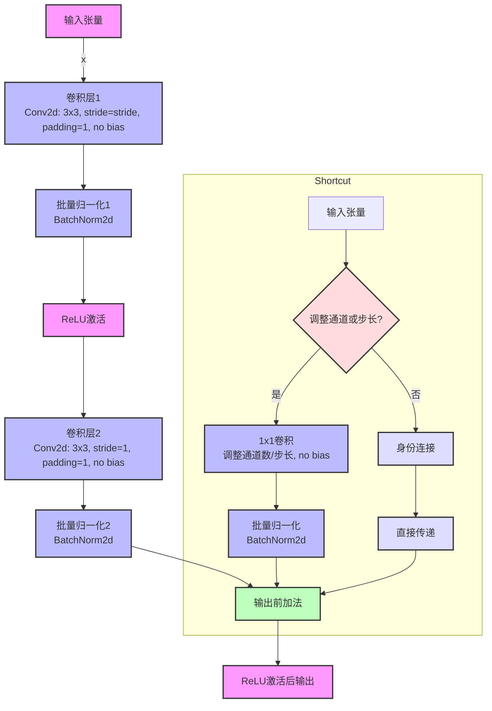
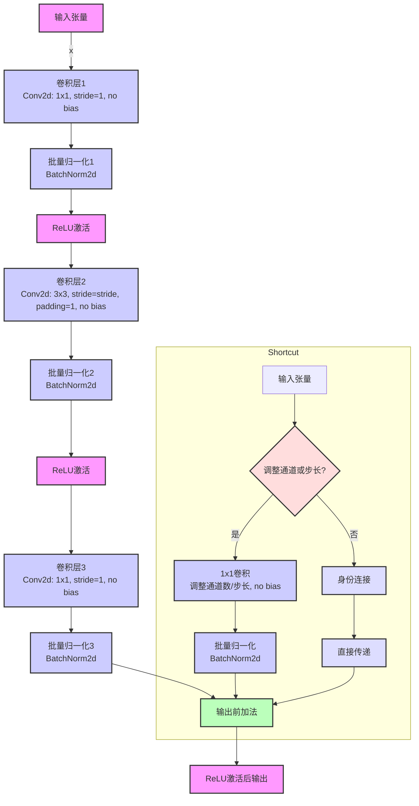
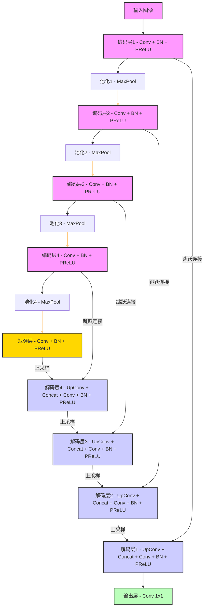

# 骨干网络

## ResNet

### 架构

ResNet 网络是一种具有残差学习框架的深度卷积神经网络，旨在解决更深网络训练中的退化问题。可分为初始卷积层、四个残差层和全连接层，每个残差层有若干个残差块。以 resnet18 为例，每个残差层有两个基础块 BasicBlock ，每个基础块含两个卷积层，一共 17 个卷积层和 1 个全连接层，故称 resnet18 。结构如下：

```python
ResNet(
  (conv1): Conv2d(3, 64, kernel_size=(7, 7), stride=(2, 2), padding=(3, 3), bias=False)
  (bn1): BatchNorm2d(64, eps=1e-05, momentum=0.1, affine=True, track_running_stats=True)
  (relu): ReLU(inplace=True)
  (maxpool): MaxPool2d(kernel_size=3, stride=2, padding=1, dilation=1, ceil_mode=False)
  (layer1): Sequential(
    (0): BasicBlock(
      (conv1): Conv2d(64, 64, kernel_size=(3, 3), stride=(1, 1), padding=(1, 1), bias=False)
      (bn1): BatchNorm2d(64, eps=1e-05, momentum=0.1, affine=True, track_running_stats=True)
      (relu): ReLU(inplace=True)
      (conv2): Conv2d(64, 64, kernel_size=(3, 3), stride=(1, 1), padding=(1, 1), bias=False)
      (bn2): BatchNorm2d(64, eps=1e-05, momentum=0.1, affine=True, track_running_stats=True)
    )
    (1): BasicBlock(
      (conv1): Conv2d(64, 64, kernel_size=(3, 3), stride=(1, 1), padding=(1, 1), bias=False)
      (bn1): BatchNorm2d(64, eps=1e-05, momentum=0.1, affine=True, track_running_stats=True)
      (relu): ReLU(inplace=True)
      (conv2): Conv2d(64, 64, kernel_size=(3, 3), stride=(1, 1), padding=(1, 1), bias=False)
      (bn2): BatchNorm2d(64, eps=1e-05, momentum=0.1, affine=True, track_running_stats=True)
    )
  )
  (layer2): Sequential(
    (0): BasicBlock(
      (conv1): Conv2d(64, 128, kernel_size=(3, 3), stride=(2, 2), padding=(1, 1), bias=False)
      (bn1): BatchNorm2d(128, eps=1e-05, momentum=0.1, affine=True, track_running_stats=True)
      (relu): ReLU(inplace=True)
      (conv2): Conv2d(128, 128, kernel_size=(3, 3), stride=(1, 1), padding=(1, 1), bias=False)
      (bn2): BatchNorm2d(128, eps=1e-05, momentum=0.1, affine=True, track_running_stats=True)
      (downsample): Sequential(
        (0): Conv2d(64, 128, kernel_size=(1, 1), stride=(2, 2), bias=False)
        (1): BatchNorm2d(128, eps=1e-05, momentum=0.1, affine=True, track_running_stats=True)
      )
    )
    (1): BasicBlock(
      (conv1): Conv2d(128, 128, kernel_size=(3, 3), stride=(1, 1), padding=(1, 1), bias=False)
      (bn1): BatchNorm2d(128, eps=1e-05, momentum=0.1, affine=True, track_running_stats=True)
      (relu): ReLU(inplace=True)
      (conv2): Conv2d(128, 128, kernel_size=(3, 3), stride=(1, 1), padding=(1, 1), bias=False)
      (bn2): BatchNorm2d(128, eps=1e-05, momentum=0.1, affine=True, track_running_stats=True)
    )
  )
  (layer3): Sequential(
    (0): BasicBlock(
      (conv1): Conv2d(128, 256, kernel_size=(3, 3), stride=(2, 2), padding=(1, 1), bias=False)
      (bn1): BatchNorm2d(256, eps=1e-05, momentum=0.1, affine=True, track_running_stats=True)
      (relu): ReLU(inplace=True)
      (conv2): Conv2d(256, 256, kernel_size=(3, 3), stride=(1, 1), padding=(1, 1), bias=False)
      (bn2): BatchNorm2d(256, eps=1e-05, momentum=0.1, affine=True, track_running_stats=True)
      (downsample): Sequential(
        (0): Conv2d(128, 256, kernel_size=(1, 1), stride=(2, 2), bias=False)
        (1): BatchNorm2d(256, eps=1e-05, momentum=0.1, affine=True, track_running_stats=True)
      )
    )
    (1): BasicBlock(
      (conv1): Conv2d(256, 256, kernel_size=(3, 3), stride=(1, 1), padding=(1, 1), bias=False)
      (bn1): BatchNorm2d(256, eps=1e-05, momentum=0.1, affine=True, track_running_stats=True)
      (relu): ReLU(inplace=True)
      (conv2): Conv2d(256, 256, kernel_size=(3, 3), stride=(1, 1), padding=(1, 1), bias=False)
      (bn2): BatchNorm2d(256, eps=1e-05, momentum=0.1, affine=True, track_running_stats=True)
    )
  )
  (layer4): Sequential(
    (0): BasicBlock(
      (conv1): Conv2d(256, 512, kernel_size=(3, 3), stride=(2, 2), padding=(1, 1), bias=False)
      (bn1): BatchNorm2d(512, eps=1e-05, momentum=0.1, affine=True, track_running_stats=True)
      (relu): ReLU(inplace=True)
      (conv2): Conv2d(512, 512, kernel_size=(3, 3), stride=(1, 1), padding=(1, 1), bias=False)
      (bn2): BatchNorm2d(512, eps=1e-05, momentum=0.1, affine=True, track_running_stats=True)
      (downsample): Sequential(
        (0): Conv2d(256, 512, kernel_size=(1, 1), stride=(2, 2), bias=False)
        (1): BatchNorm2d(512, eps=1e-05, momentum=0.1, affine=True, track_running_stats=True)
      )
    )
    (1): BasicBlock(
      (conv1): Conv2d(512, 512, kernel_size=(3, 3), stride=(1, 1), padding=(1, 1), bias=False)
      (bn1): BatchNorm2d(512, eps=1e-05, momentum=0.1, affine=True, track_running_stats=True)
      (relu): ReLU(inplace=True)
      (conv2): Conv2d(512, 512, kernel_size=(3, 3), stride=(1, 1), padding=(1, 1), bias=False)
      (bn2): BatchNorm2d(512, eps=1e-05, momentum=0.1, affine=True, track_running_stats=True)
    )
  )
  (avgpool): AdaptiveAvgPool2d(output_size=(1, 1))
  (fc): Linear(in_features=512, out_features=1000, bias=True)
)
```


| 层级   | 类型           | 详情                                              |
| ------ | -------------- | ------------------------------------------------- |
| 输入层 | 输入           | 输入图像                                          |
| 1      | 卷积层         | Conv2d: 7x7, stride=2, padding=3                  |
| 2      | 批量归一化     | BatchNorm2d                                       |
| 3      | 激活层         | ReLU                                              |
| 4      | 池化层         | MaxPool2d: 3x3, stride=2, padding=1               |
| 5      | 残差层 1       | Layer1: _make_layer(BasicBlock, 64, 2, stride=1)  |
| 6      | 残差层 2       | Layer2: _make_layer(BasicBlock, 128, 2, stride=2) |
| 7      | 残差层 3       | Layer3: _make_layer(BasicBlock, 256, 2, stride=2) |
| 8      | 残差层 4       | Layer4: _make_layer(BasicBlock, 512, 2, stride=2) |
| 9      | 自适应平均池化 | AdaptiveAvgPool2d: (1, 1)                         |
| 10     | 平铺           | Flatten                                           |
| 11     | 全连接层       | Linear: 512*block.expansion to num_classes        |
| 输出层 | 输出           | 输出分类结果                                      |

残差块分为基础块 BasicBlock 和瓶颈层 Bottleneck ，结构如下：

**BasicBlock** ：



**Bottleneck**：



### 实现

定义两种残差块函数和主干函数。

```python
import torch
import torch.nn as nn
```

```python
class BasicBlock(nn.Module):
    expansion = 1

    def __init__(self, in_planes, planes, stride=1):
        super(BasicBlock, self).__init__()
        # 第一个卷积层
        self.conv1 = nn.Conv2d(
            in_planes, planes, kernel_size=3, stride=stride, padding=1, bias=False)
        self.bn1 = nn.BatchNorm2d(planes)
        # 第二个卷积层
        self.conv2 = nn.Conv2d(
            planes, planes, kernel_size=3, stride=1, padding=1, bias=False)
        self.bn2 = nn.BatchNorm2d(planes)

        self.relu = nn.ReLU(inplace=True)
        
        self.shortcut = nn.Sequential()
        if stride != 1 or in_planes != self.expansion*planes:
            # shortcut连接，如果维度不匹配则通过1x1卷积调整维度
            self.shortcut = nn.Sequential(
                nn.Conv2d(in_planes, self.expansion*planes, kernel_size=1, stride=stride, bias=False),
                nn.BatchNorm2d(self.expansion*planes)
            )

    def forward(self, x):
        out = self.relu(self.bn1(self.conv1(x)))
        out = self.bn2(self.conv2(out))
        out += self.shortcut(x)
        out = self.relu(out)
        return out
```

```python
class Bottleneck(nn.Module):
    expansion = 4

    def __init__(self, in_planes, planes, stride=1):
        super(Bottleneck, self).__init__()
        # 第一个1x1卷积，用于降维，一般planes设为目标通道数的四分之一，减少计算量
        self.conv1 = nn.Conv2d(in_planes, planes, kernel_size=1, bias=False)
        self.bn1 = nn.BatchNorm2d(planes)
        
        # 第二个3x3卷积，用于提取特征，可能会改变特征图的尺寸
        self.conv2 = nn.Conv2d(planes, planes, kernel_size=3, stride=stride, padding=1, bias=False)
        self.bn2 = nn.BatchNorm2d(planes)
        
        # 第三个1x1卷积，用于扩维，恢复维度
        self.conv3 = nn.Conv2d(planes, self.expansion * planes, kernel_size=1, bias=False)
        self.bn3 = nn.BatchNorm2d(self.expansion * planes)

        self.relu = nn.ReLU(inplace=True)
        
        # 添加shortcut连接
        self.shortcut = nn.Sequential()
        if stride != 1 or in_planes != self.expansion * planes:
            # 如果维度不匹配，则使用1x1卷积进行调整
            self.shortcut = nn.Sequential(
                nn.Conv2d(in_planes, self.expansion * planes, kernel_size=1, stride=stride, bias=False),
                nn.BatchNorm2d(self.expansion * planes)
            )

    def forward(self, x):
        # 通过三个卷积层
        out = self.relu(self.bn1(self.conv1(x)))
        out = self.relu(self.bn2(self.conv2(out)))
        out = self.bn3(self.conv3(out))
        
        # 通过shortcut连接
        out += self.shortcut(x)
        out = self.relu(out)

        return out
```

```python
class ResNet(nn.Module):
    def __init__(self, block, num_blocks, num_classes=10):
        super(ResNet, self).__init__()
        self.in_planes = 64

        # 初始卷积层
        self.conv1 = nn.Conv2d(3, 64, kernel_size=7, stride=2, padding=3, bias=False)
        self.bn1 = nn.BatchNorm2d(64)
        self.relu = nn.ReLU(inplace=True)
        self.maxpool = nn.MaxPool2d(kernel_size=3, stride=2, padding=1)
        # 创建4个层级的ResNet层
        self.layer1 = self._make_layer(block, 64, num_blocks[0], stride=1)
        self.layer2 = self._make_layer(block, 128, num_blocks[1], stride=2)
        self.layer3 = self._make_layer(block, 256, num_blocks[2], stride=2)
        self.layer4 = self._make_layer(block, 512, num_blocks[3], stride=2)
        self.avgpool = nn.AdaptiveAvgPool2d((1, 1))
        self.linear = nn.Linear(512*block.expansion, num_classes)

    def _make_layer(self, block, planes, num_blocks, stride):
        strides = [stride] + [1]*(num_blocks-1)
        layers = []
        for stride in strides:
            layers.append(block(self.in_planes, planes, stride))
            self.in_planes = planes * block.expansion
        return nn.Sequential(*layers)

    def forward(self, x):
        out = self.conv1(x)
        out = self.bn1(out)
        out = self.relu(out)
        out = self.maxpool(out)
        
        out = self.layer1(out)
        out = self.layer2(out)
        out = self.layer3(out)
        out = self.layer4(out)
        
        out = self.avgpool(out)
        out = out.view(out.size(0), -1)
        out = self.linear(out)
        return out
```

对于残差块的选择，resnet50 及以上的版本中使用瓶颈层 Bottleneck ，主要原因是为了增加网络的深度，同时控制模型的计算复杂性和参数数量。

```python
def ResNet18():
    # 使用基础块，每个层级的块数量为 [2, 2, 2, 2]
    return ResNet(BasicBlock, [2, 2, 2, 2])

def ResNet34():
    # 使用基础块，每个层级的块数量为 [3, 4, 6, 3]
    return ResNet(BasicBlock, [3, 4, 6, 3])

def ResNet50():
    # 使用瓶颈层，每个层级的块数量为 [3, 4, 6, 3]
    return ResNet(Bottleneck, [3, 4, 6, 3])

def ResNet101():
    # 使用瓶颈层，每个层级的块数量为 [3, 4, 23, 3]
    return ResNet(Bottleneck, [3, 4, 23, 3])

def ResNet152():
    # 使用瓶颈层，每个层级的块数量为 [3, 8, 36, 3]
    return ResNet(Bottleneck, [3, 8, 36, 3])
```

## U-Net

### 架构

U-Net的架构设计主要用于图像分割，包括一个收缩路径和一个扩张路径，中间通过跳跃连接传递特征信息。它通常包含一个初始卷积层，几个编码器和解码器层，以及最终的分类层。其中，收缩路径包括多个卷积和池化层，扩张路径则包含多个上采样和卷积层，中间的每个卷积层后通常都有跳跃连接。网络的输出是经过最后一个1x1卷积层处理的特征图，用于生成与输入图像相同尺寸的分割图。结构如下：

```python
UNetModel(
  (encode_layer1): Sequential(
    (0): Conv2d(1, 32, kernel_size=(3, 3), stride=(1, 1), padding=(1, 1))
    (1): BatchNorm2d(32, eps=1e-05, momentum=0.1, affine=True, track_running_stats=True)
    (2): PReLU(num_parameters=1)
    (3): Conv2d(32, 32, kernel_size=(3, 3), stride=(1, 1), padding=(1, 1))
    (4): BatchNorm2d(32, eps=1e-05, momentum=0.1, affine=True, track_running_stats=True)
    (5): PReLU(num_parameters=1)
  )
  (pool1): MaxPool2d(kernel_size=2, stride=2, padding=0, dilation=1, ceil_mode=False)
  (encode_layer2): Sequential(
    (0): Conv2d(32, 64, kernel_size=(3, 3), stride=(1, 1), padding=(1, 1))
    (1): BatchNorm2d(64, eps=1e-05, momentum=0.1, affine=True, track_running_stats=True)
    (2): PReLU(num_parameters=1)
    (3): Conv2d(64, 64, kernel_size=(3, 3), stride=(1, 1), padding=(1, 1))
    (4): BatchNorm2d(64, eps=1e-05, momentum=0.1, affine=True, track_running_stats=True)
    (5): PReLU(num_parameters=1)
  )
  (pool2): MaxPool2d(kernel_size=2, stride=2, padding=0, dilation=1, ceil_mode=False)
  (encode_layer3): Sequential(
    (0): Conv2d(64, 128, kernel_size=(3, 3), stride=(1, 1), padding=(1, 1))
    (1): BatchNorm2d(128, eps=1e-05, momentum=0.1, affine=True, track_running_stats=True)
    (2): PReLU(num_parameters=1)
    (3): Conv2d(128, 128, kernel_size=(3, 3), stride=(1, 1), padding=(1, 1))
    (4): BatchNorm2d(128, eps=1e-05, momentum=0.1, affine=True, track_running_stats=True)
    (5): PReLU(num_parameters=1)
  )
  (pool3): MaxPool2d(kernel_size=2, stride=2, padding=0, dilation=1, ceil_mode=False)
  (encode_layer4): Sequential(
    (0): Conv2d(128, 256, kernel_size=(3, 3), stride=(1, 1), padding=(1, 1))
    (1): BatchNorm2d(256, eps=1e-05, momentum=0.1, affine=True, track_running_stats=True)
    (2): PReLU(num_parameters=1)
    (3): Conv2d(256, 256, kernel_size=(3, 3), stride=(1, 1), padding=(1, 1))
    (4): BatchNorm2d(256, eps=1e-05, momentum=0.1, affine=True, track_running_stats=True)
    (5): PReLU(num_parameters=1)
  )
  (pool4): MaxPool2d(kernel_size=2, stride=2, padding=0, dilation=1, ceil_mode=False)
  (encode_decode_layer): Sequential(
    (0): Conv2d(256, 512, kernel_size=(3, 3), stride=(1, 1), padding=(1, 1))
    (1): BatchNorm2d(512, eps=1e-05, momentum=0.1, affine=True, track_running_stats=True)
    (2): PReLU(num_parameters=1)
    (3): Conv2d(512, 512, kernel_size=(3, 3), stride=(1, 1), padding=(1, 1))
    (4): BatchNorm2d(512, eps=1e-05, momentum=0.1, affine=True, track_running_stats=True)
    (5): PReLU(num_parameters=1)
  )
  (upconv4): ConvTranspose2d(512, 256, kernel_size=(2, 2), stride=(2, 2))
  (decode_layer4): Sequential(
    (0): Conv2d(512, 256, kernel_size=(3, 3), stride=(1, 1), padding=(1, 1))
    (1): BatchNorm2d(256, eps=1e-05, momentum=0.1, affine=True, track_running_stats=True)
    (2): PReLU(num_parameters=1)
    (3): Conv2d(256, 256, kernel_size=(3, 3), stride=(1, 1), padding=(1, 1))
    (4): BatchNorm2d(256, eps=1e-05, momentum=0.1, affine=True, track_running_stats=True)
    (5): PReLU(num_parameters=1)
  )
  (upconv3): ConvTranspose2d(256, 128, kernel_size=(2, 2), stride=(2, 2))
  (decode_layer3): Sequential(
    (0): Conv2d(256, 128, kernel_size=(3, 3), stride=(1, 1), padding=(1, 1))
    (1): BatchNorm2d(128, eps=1e-05, momentum=0.1, affine=True, track_running_stats=True)
    (2): PReLU(num_parameters=1)
    (3): Conv2d(128, 128, kernel_size=(3, 3), stride=(1, 1), padding=(1, 1))
    (4): BatchNorm2d(128, eps=1e-05, momentum=0.1, affine=True, track_running_stats=True)
    (5): PReLU(num_parameters=1)
  )
  (upconv2): ConvTranspose2d(128, 64, kernel_size=(2, 2), stride=(2, 2))
  (decode_layer2): Sequential(
    (0): Conv2d(128, 64, kernel_size=(3, 3), stride=(1, 1), padding=(1, 1))
    (1): BatchNorm2d(64, eps=1e-05, momentum=0.1, affine=True, track_running_stats=True)
    (2): PReLU(num_parameters=1)
    (3): Conv2d(64, 64, kernel_size=(3, 3), stride=(1, 1), padding=(1, 1))
    (4): BatchNorm2d(64, eps=1e-05, momentum=0.1, affine=True, track_running_stats=True)
    (5): PReLU(num_parameters=1)
  )
  (upconv1): ConvTranspose2d(64, 32, kernel_size=(2, 2), stride=(2, 2))
  (decode_layer1): Sequential(
    (0): Conv2d(64, 32, kernel_size=(3, 3), stride=(1, 1), padding=(1, 1))
    (1): BatchNorm2d(32, eps=1e-05, momentum=0.1, affine=True, track_running_stats=True)
    (2): PReLU(num_parameters=1)
    (3): Conv2d(32, 32, kernel_size=(3, 3), stride=(1, 1), padding=(1, 1))
    (4): BatchNorm2d(32, eps=1e-05, momentum=0.1, affine=True, track_running_stats=True)
    (5): PReLU(num_parameters=1)
  )
  (out_layer): Sequential(
    (0): Conv2d(32, 2, kernel_size=(1, 1), stride=(1, 1))
  )
)
```



### 实现

网络的设计遵循尺寸与通道数呈反比。

```python
import torch
```

```python
class UNetModel(torch.nn.Module):

    def __init__(self, in_features=1, out_features=2, init_features=32, rebellious_phase=False):
        super(UNetModel, self).__init__()
        features = init_features
        self.encode_layer1 = torch.nn.Sequential(
            torch.nn.Conv2d(in_channels=in_features, out_channels=features, kernel_size=3, padding=1, stride=1),
            torch.nn.BatchNorm2d(num_features=features),
            torch.nn.PReLU(),
            torch.nn.Conv2d(in_channels=features, out_channels=features, kernel_size=3, padding=1, stride=1),
            torch.nn.BatchNorm2d(num_features=features),
            torch.nn.PReLU()
        )
        self.pool1 = torch.nn.MaxPool2d(kernel_size=2, stride=2)
        self.encode_layer2 = torch.nn.Sequential(
            torch.nn.Conv2d(in_channels=features, out_channels=features*2, kernel_size=3, padding=1, stride=1),
            torch.nn.BatchNorm2d(num_features=features*2),
            torch.nn.PReLU(),
            torch.nn.Conv2d(in_channels=features*2, out_channels=features*2, kernel_size=3, padding=1, stride=1),
            torch.nn.BatchNorm2d(num_features=features * 2),
            torch.nn.PReLU()
        )
        self.pool2 = torch.nn.MaxPool2d(kernel_size=2, stride=2)
        self.encode_layer3 = torch.nn.Sequential(
            torch.nn.Conv2d(in_channels=features*2, out_channels=features*4, kernel_size=3, padding=1, stride=1),
            torch.nn.BatchNorm2d(num_features=features * 4),
            torch.nn.PReLU(),
            torch.nn.Conv2d(in_channels=features*4, out_channels=features*4, kernel_size=3, padding=1, stride=1),
            torch.nn.BatchNorm2d(num_features=features * 4),
            torch.nn.PReLU()
        )
        self.pool3 = torch.nn.MaxPool2d(kernel_size=2, stride=2)
        self.encode_layer4 = torch.nn.Sequential(
            torch.nn.Conv2d(in_channels=features*4, out_channels=features*8, kernel_size=3, padding=1, stride=1),
            torch.nn.BatchNorm2d(num_features=features * 8),
            torch.nn.PReLU(),
            torch.nn.Conv2d(in_channels=features*8, out_channels=features*8, kernel_size=3, padding=1, stride=1),
            torch.nn.BatchNorm2d(num_features=features * 8),
            torch.nn.PReLU(),
        )
        self.pool4 = torch.nn.MaxPool2d(kernel_size=2, stride=2)
        self.encode_decode_layer = torch.nn.Sequential(
            torch.nn.Conv2d(in_channels=features*8, out_channels=features*16, kernel_size=3, padding=1, stride=1),
            torch.nn.BatchNorm2d(num_features=features * 16),
            torch.nn.PReLU(),
            torch.nn.Conv2d(in_channels=features*16, out_channels=features*16, kernel_size=3, padding=1, stride=1),
            torch.nn.BatchNorm2d(num_features=features * 16),
            torch.nn.PReLU()
        )
        self.upconv4 = torch.nn.ConvTranspose2d(
            features * 16, features * 8, kernel_size=2, stride=2
        )
        self.decode_layer4 = torch.nn.Sequential(
            torch.nn.Conv2d(in_channels=features*16, out_channels=features*8, kernel_size=3, padding=1, stride=1),
            torch.nn.BatchNorm2d(num_features=features*8),
            torch.nn.PReLU(),
            torch.nn.Conv2d(in_channels=features*8, out_channels=features*8, kernel_size=3, padding=1, stride=1),
            torch.nn.BatchNorm2d(num_features=features * 8),
            torch.nn.PReLU(),
        )
        self.upconv3 = torch.nn.ConvTranspose2d(
            features * 8, features * 4, kernel_size=2, stride=2
        )
        self.decode_layer3 = torch.nn.Sequential(
            torch.nn.Conv2d(in_channels=features*8, out_channels=features*4, kernel_size=3, padding=1, stride=1),
            torch.nn.BatchNorm2d(num_features=features * 4),
            torch.nn.PReLU(),
            torch.nn.Conv2d(in_channels=features*4, out_channels=features*4, kernel_size=3, padding=1, stride=1),
            torch.nn.BatchNorm2d(num_features=features * 4),
            torch.nn.PReLU()
        )
        self.upconv2 = torch.nn.ConvTranspose2d(
            features * 4, features * 2, kernel_size=2, stride=2
        )
        self.decode_layer2 = torch.nn.Sequential(
            torch.nn.Conv2d(in_channels=features*4, out_channels=features*2, kernel_size=3, padding=1, stride=1),
            torch.nn.BatchNorm2d(num_features=features * 2),
            torch.nn.PReLU(),
            torch.nn.Conv2d(in_channels=features*2, out_channels=features*2, kernel_size=3, padding=1, stride=1),
            torch.nn.BatchNorm2d(num_features=features * 2),
            torch.nn.PReLU()
        )
        self.upconv1 = torch.nn.ConvTranspose2d(
            features * 2, features, kernel_size=2, stride=2
        )
        self.decode_layer1 = torch.nn.Sequential(
            torch.nn.Conv2d(in_channels=features*2, out_channels=features, kernel_size=3, padding=1, stride=1),
            torch.nn.BatchNorm2d(num_features=features),
            torch.nn.PReLU(),
            torch.nn.Conv2d(in_channels=features, out_channels=features, kernel_size=3, padding=1, stride=1),
            torch.nn.BatchNorm2d(num_features=features),
            torch.nn.PReLU()
        )
        self.out_layer = torch.nn.Sequential(
            torch.nn.Conv2d(in_channels=features, out_channels=out_features, kernel_size=1, padding=0, stride=1),
        )

    def forward(self, x):
        enc1 = self.encode_layer1(x)
        enc2 = self.encode_layer2(self.pool1(enc1))
        enc3 = self.encode_layer3(self.pool2(enc2))
        enc4 = self.encode_layer4(self.pool3(enc3))

        bottleneck = self.encode_decode_layer(self.pool4(enc4))
        dec4 = self.upconv4(bottleneck)
        dec4 = torch.cat((dec4, enc4), dim=1)
        dec4 = self.decode_layer4(dec4)

        dec3 = self.upconv3(dec4)
        dec3 = torch.cat((dec3, enc3), dim=1)
        dec3 = self.decode_layer3(dec3)

        dec2 = self.upconv2(dec3)
        dec2 = torch.cat((dec2, enc2), dim=1)
        dec2 = self.decode_layer2(dec2)

        dec1 = self.upconv1(dec2)
        dec1 = torch.cat((dec1, enc1), dim=1)
        dec1 = self.decode_layer1(dec1)

        out = self.out_layer(dec1)
        return out
```

